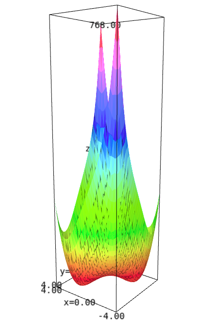
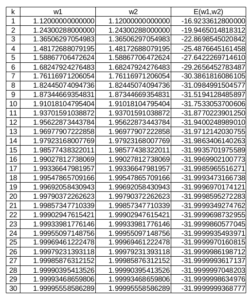
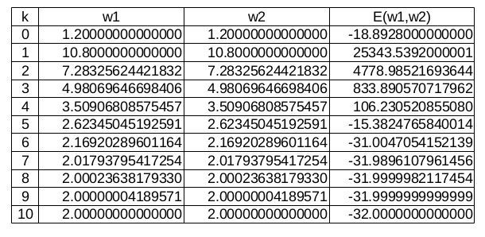

--- 
pagetitle: Gradient Descent 
colorlinks: true 
linkcolor: blue
link-citations: true 
csl: [../../resources/stat.csl]
bibliography: [../../references/references.bib]
reference-section-title: References 
xnos-cleveref: True 
---

\newcommand{\Ber}{\operatorname{Ber}}
\newcommand{\E}{\operatorname{E}}
\newcommand{\V}{\operatorname{Var}}
\newcommand{\diag}{\operatorname{diag}}

\newcommand{\bi}{\mathbf{i}}
\newcommand{\bj}{\mathbf{j}}
\newcommand{\bt}{\mathbf{t}}

\newcommand{\bw}{{\boldsymbol{w}}}
\newcommand{\bu}{{\boldsymbol{u}}}
\newcommand{\bv}{{\boldsymbol{v}}}
\newcommand{\bx}{{\boldsymbol{x}}}
\newcommand{\by}{{\boldsymbol{y}}}
\newcommand{\bb}{{\boldsymbol{b}}}
\newcommand{\bz}{{\boldsymbol{z}}}
\newcommand{\bX}{{\boldsymbol{X}}}
\newcommand{\bY}{{\boldsymbol{Y}}}
\newcommand{\bZ}{{\boldsymbol{Z}}}

# Gradient Descent

## Motivation

In Linear Regression, we studied how to minimize the error function
$$ E = \sum_{j=1}^{N} (y_j-\sum_{s=1}^{k+1} x_{js}m_{s})^2 $$ and obtained an exact solution. In other cases we will encounter later, such an exact solution is not feasible 
and we will have to use a method to approximate an exact solution. One of the most common methods for this purpose is *gradient descent*.
 
## Basic Algorithm

Consider a function $E: \mathbb R^n \rightarrow \mathbb R$, $\bw=(w_1, w_2, \dots , w_n) \rightarrow E(\bw)$. The *gradient* $\nabla E$  of $E$ is defined by
$$  \nabla E := \left ( \frac {\partial E}{\partial w_1}, \frac {\partial E}{\partial w_2}, \dots , \frac {\partial E}{\partial w_n} \right ). $$

**Proposition **:
*Assume that $E(\bw)$ is differentiable in a neighborhood of $\bw$. Then 
the function $E(\bw)$ decreases fastest in the direction of $-\nabla E (\bw)$.*

**Proof:** For a unit vector $\bu$, the directional derivative $D_\bu E$ is given by
$$ D_\bu E= \nabla E \cdot \bu = | \nabla E | |\bu| \cos \theta = | \nabla E | \cos \theta ,$$ where $\theta$ is the angle between $\nabla E$ and $\bu$. The minimum value of $D_\bu E$ occurs when $\cos \theta$ is $-1$. &nbsp; &nbsp; $\square$

Set $$ \bw_{k+1}=\bw_k - \eta \nabla E(\bw_k) $$
where $\eta >0$ is the step size or *learning rate*.
 Then $$ E(\bw_{k+1}) \le E(\bw_{k}).$$ Under some moderate conditions,
$$ E(\bw_k) \rightarrow \text{local minimum} \qquad \text{ as }\ k \rightarrow \infty .$$In particular, this is true when $E$ is convex or when $\nabla E$ is Lipschitz continuous.  

### Example

Consider $E(\bw)=E(w_1,w_2)= w_1^4+w_2^4-16w_1w_2$.
Then $\nabla E(\bw)= [ 4w_1^3-16w_2, 4w_2^3-16w_1]$. 
 Choose $\bw_0=(1,1)$ and 
$\eta =0.01$. Then
$$ \bw_{30}=(1.99995558586289, 1.99995558586289)$$ 
and we get 
 $$ E(\bw_{30})= -31.9999999368777. $$

We see that $\bw_k \rightarrow (2,2)$ and 
$E(2,2)=-32$.
Indeed, using multi-variable calculus, one can verify that  when $\bw=(2,2)$, a local minimum of $E(\bw)$ is $-32$.

**Exercise**: Using multi-variable calculus, find all the local minima of $E(\bw)$.

{#fig:des width=30\%} 

{#fig:tab width=50\%}

### Example: Linear Regression revisited

We will apply gradient descent to linear regression in the lab session.

**Exercise**: Define
$\sigma(x) = \dfrac {e^x}{e^x+1}= \dfrac 1 {1+e^{-x}}$.
In Logistic Regression we will minimize the following error function 
$$ E (\bw) = - \sum_{n=1}^N \{ t_n \ln y_n + (1-t_n) \ln (1-y_n)\},  $$
where we write $\bw =(w_1, w_2, \dots , w_{k+1})$ and $y_n=\sigma(w_1 x_{n1}+ w_2 x_{n2} + \cdots + w_k x_{nk}+w_{k+1} )$. Compute the gradient $\nabla E(\bw)$. 

## Newton's Method

Let us first consider the single-variable case.

- Let $f: \mathbb R \longrightarrow \mathbb R$ be a single-variable (convex, differentiable) function.

- To find a local minimum 
 $\Longleftrightarrow$  \qquad To find $x^*$ such that $f'(x^*)=0$  
Make a guess $x_0$ for $x^*$ and set $x=x_0+h$.

- Using the Taylor expansion, we have
\begin{align*} f(x) &=f(x_0+h) \approx f(x_0) + f'(x_0) h+ \tfrac 1 2 f''(x_0) h^2 \\ f'(x) = \frac{df}{dh}\frac {dh}{dx} & \approx \frac d {dh} \left ( f(x_0) + f'(x_0) h+ \tfrac 1 2 f''(x_0) h^2 \right ) \\
&= f'(x_0) + f''(x_0)h \end{align*}
 If $0 = f'(x_0) + f''(x_0)h$, we obtain $$ h = - f'(x_0)/f''(x_0). $$

- We have shown that $$ x_1=x_0- f'(x_0)/f''(x_0) $$ is an approximation of $x^*$. 

- Repeat the process to obtain 
$$ \boxed{x_{k+1}=x_k- f'(x_k)/f''(x_k)},  $$
and $x_k \rightarrow x^*$ as $k \rightarrow \infty$.

Now we consider the multi-variable case.

- Let $E(\bw)$ be a multi-variable function. 
 The *Hessian matrix* of $E$ is defined by
$$ \mathbf H E= \begin{bmatrix} \tfrac {\partial^2 E}{\partial w_1^2} &  \tfrac {\partial^2 E}{\partial w_1 \partial w_2} & \cdots &  \tfrac {\partial^2 E}{\partial w_1 \partial w_n} \\ \tfrac {\partial^2 E}{\partial w_2 \partial w_1} & \tfrac {\partial^2 E}{\partial w_2^2} & \cdots & \tfrac {\partial^2 E}{\partial w_2 \partial w_n} \\ \vdots & \vdots & \ddots & \vdots \\ \tfrac {\partial^2 E}{\partial w_n \partial w_1} & \tfrac {\partial^2 E}{\partial w_n \partial w_2} & \cdots & \tfrac {\partial^2 E}{\partial w_n^2}  \end{bmatrix}. $$ That is, $\mathbf H E= [ \tfrac {\partial^2 E}{\partial w_i \partial w_j}]$.

- Generalizing the single-variable case, we obtain  
$$ \boxed{ \bw_{k+1}= \bw_k - \mathbf H E (\bw_{k})^{-1} \nabla E(\bw_k)} . $$

- Using a step size $\eta$, the formula may be modified to be
$$  \boxed{ \bw_{k+1}= \bw_k - \eta \mathbf H E (\bw_{k})^{-1} \nabla E(\bw_k)} . $$

- Newton's method is much faster than Gradient Descent. However, it may be expensive to compute the inverse of the Hessian matrix. 

### Example

- Consider $E(\bw)=E(w_1,w_2)= w_1^4+w_2^4-16w_1w_2$. Then
$\nabla E(\bw)= [ 4w_1^3-16w_2, 4w_2^3-16w_1]^\top$.

\begin{align*} \mathbf H E(\bw) &= \begin{bmatrix} 12 w_1^2 & -16 \\ -16 & 12 w_2^2 \end{bmatrix} \\ \\ \mathbf H E(\bw)^{-1} &= \frac 1 {9w_1^2 w_2^2 -16} \begin{bmatrix} \tfrac 3 4 w_2^2 & 1 \\ 1& \frac 3 4 w_1^2  \end{bmatrix} \\  \\
\mathbf H E^{-1} \nabla E & = \frac 1 {9w_1^2 w_2^2 -16} \begin{bmatrix} 3 w_1^3 w_2^2 -8 w_2^3 -16w_1 \\ 3 w_1^2 w_2^3 -8 w_1^3  -16w_2  \end{bmatrix} \end{align*}

<!---
- Choose
$\bw_0=(1,1)$ and
$\eta =1$.
Then $\bw_{1}=(2,2)$
 and $E(\bw_{1})= -32$.
-->

- Choose
$\bw_0=(1.2,1.2)$ and 
$\eta =1$.
Then
$\bw_{9}=(2.00000004189571, 2.00000004189571)$,
$E(\bw_{9})= -31.9999999999999$.

{#fig:tab width=50\%}

### Stochastic Gradient Descent (SGD)

Typically in Machine Learning, the function $E(\bw)$ is given by a sum of the form
$$ E(\bw) = \frac 1 N \sum_{n=1}^N E_n(\bw), $$
where $N$ is the number of elements in the training set.
When $N$ is large, computation of the gradient $\nabla E$ may be expensive.

The SGD selects a sample from the training set in each iteration step instead of using the whole batch of the training set, and use $$ \frac 1 M \sum_{i=1}^M \nabla E_{n_i}(\bw) ,$$ where $M$ is the size of the sample and $\{ n_1, n_2 , \dots , n_M \} \subset \{ 1,2, \dots , N \}$. The SGD is commonly used in many Machine Learning algorithms.

   

