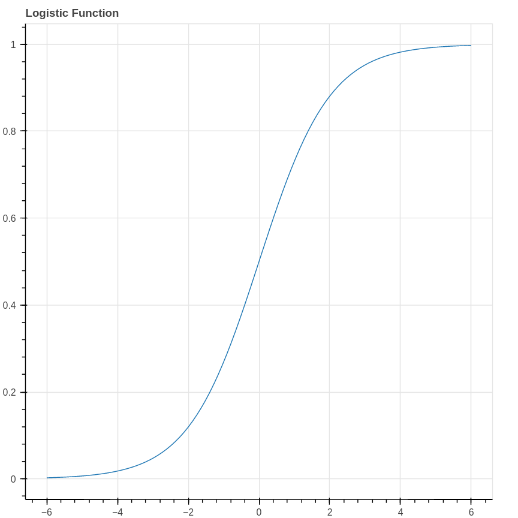
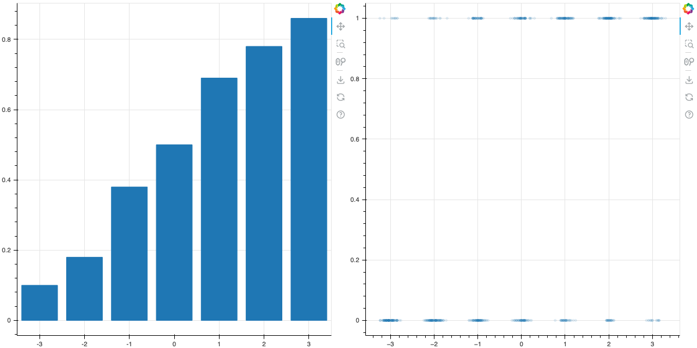

## Logistic Regression

### The logistic model

The log-odds of an event increase linearly with an independent variable.

$$
\log\frac{p}{1-p} = ax+b
$$

**Example:** The chance that a person buys a product depends on how many times they encounter advertising for that product.

### The sigmoid function

$$
\log\frac{p}{1-p}=ax+b
$$

means that

$$
p(x)=\frac{1}{1+e^{-ax-b}}
$$

### The logistic curve

The function

$$
\sigma(x)=\frac{1}{1+e^{-x}}
$$

is called the logistic function.

{width=50%}

### Sample data

Likelihood of event increases with $x$. Out of 100 tries:

| $x$                      | -3  | -2  | -1  | 0   | 1   | 2   | 3   |
| ------------------------ | --- | --- | --- | --- | --- | --- | --- |
| Occurrences (out of 100) | 10  | 18  | 38  | 50  | 69  | 78  | 86  |

### Two points of view

{width=4in}

### The Likelihood

The parameters $a$ and $b$ are unknown. But if we knew them, then
we could figure out how likely our results were. For example,
the chance of getting $10$ positive outcomes is

$$
p(10+ | x=-3, a,b) = C(\sigma(a(-3)+b)^{10}(1-\sigma(a(-3)+b))^{90}
$$

where $C$ is a constant (it's a binomial coefficient).

### More on the likelihood

Assuming independence (given $x$, $a$, and $b$) the chance of our data
is

$$
P(\mathrm{data}|a,b)=C P(10+|x=-3)P(18+|x=-2)\cdotsP(86+|x=3)
$$

### Still more

Here each term is

$$
P(y+|x)=\sigma(ax+b)^{y}(1-\sigma(ax+b)^{N(x)-y}
$$

where $N(x)$ is the number of trials with that given $x$ value. (this is a Binomial random variable).

### The log likelihood

We want to find the $a$ and $b$ that make our observed data _most likely_. To do this we need to find $a,b$ that maximize $P$ or, more simply $\log P$.

$$
\log P = \sum_{i=0}^{6} \left[ y_{i}\log P(y_{i}|x_{i}) + (100-y_{i})\log(1-p(y_{i}|x_{i}))\right]
$$

We can drop the constant since it won't affect where the maximum occurs.

### Vector/Regression Form

Our data matrix consists of $N$ rows (and 1 column), one for each person viewing the ads. The entry in each row is the number of times they saw the add.

The target matrix consists of 0 and 1 depending on whether they made a purchase or not.

We want to "fit" an equation that gives $0$ or $1$ as a function of $x$, but we can't do this exactly, only in probabilistic terms.

This is why it's called "regression."

### More on Vector/Regression Form

For each row of our matrix, the chance that $y_i$ is $1$
is $p(x_i)$ (given by the sigmoid function with parameters $a$, $b$) and the chance that $y_i=0$ is $(1-p(x_i))$. So our likelihood is

$$
L(a,b) = C \prod_{i=0}^{N-1} p(x_i)^{y_{i}}(1-p(x_i))^{(1-y_i)}
$$

and

$$
\log L(a,b) = C'+\prod_{i=1}^{N-1} y_{i} \log p(x_i) + (1-y_{i})\log(1-p(x_i)).
$$

Ignoring irrelevant constants this is

$$
\log L = Y\cdot\log p(X) + (1-Y)\cdot\log(1-p(X))
$$

where for each row of $X$, $p(X)$ has $\sigma(ax_i+b)$ with
(unknown) parameters $a$ and $b$.

### The case of multiple features

In the case of multiple features, we have a set of $k$ measurements for each sample (perhaps exposure to different types of ads)
and a single outcome (buy/do not buy). This yields an $N\times k$ data matrix $X$. We seek a set of weights $m_{1},\ldots, m_{k}$
and an "intercept" $b$ so that

$$
\log\frac{p}{1-p}=\sum m_{i}x_{i}+b
$$

relates the log-odds of our event occurring with the values of the features.

**Note:** Just as with linear regression, we can create a "fake" feature that is all $1$, and then extend our data matrix to $N\times (k+1)$.
Then $b=m_{k+1}$ and we can write

$$
\log\frac{P}{1-P}=XM
$$

where the right side is an $N\times 1$ matrix and the left side is an $N\times 1$ matrix whose entries are $\log\frac{p}{1-p}$.

### The probability

From this we get the matrix equation

$$
P = \sigma(XM)
$$

The matrix $P$ has the probability of getting a positive outcome for each sample given the features.

### A geometric remark

One way to think of this is that if the features (a row of $X$), thought of as a vector, points "more in the direction of the weight vector" $M$,
then the probability of getting a positive outcome increases. If it's perpendicular, you get even odds. If it points oppositve the weight vector,
you're unlikely to get what you want.

### The target

We have a vector $Y$ which records when our event happened, and when it didn't.

### The log-likelihood

$$
L(M) = Y^{\intercal}\log(\sigma(XM))+(1-Y^{\intercal})(1-\log(\sigma(XM)))
$$

**Problem:** Given $X$ and $Y$, find $M$ that maximizes this.
