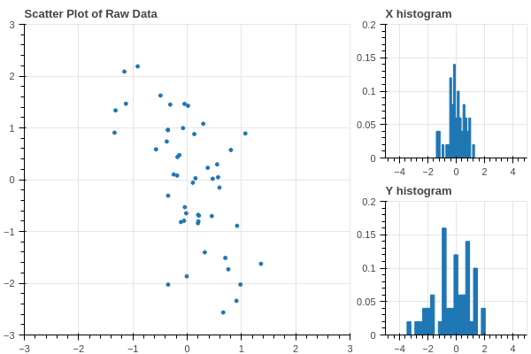
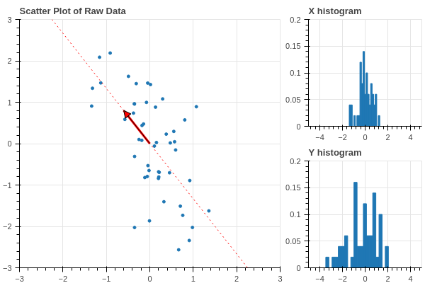
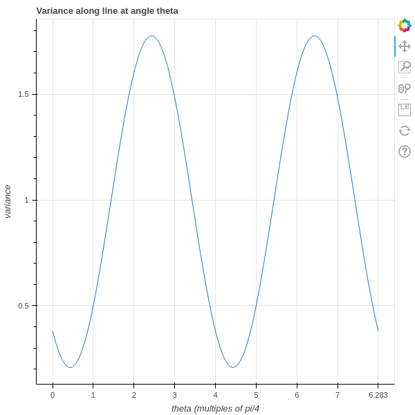
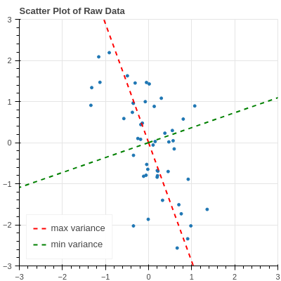

--- 
pagetitle: Principal Components
colorlinks: true 
linkcolor: blue
link-citations: true 
csl: [../../resources/stat.csl]
bibliography: [../../references/references.bib]
reference-section-title: References 
---

# Principal Component Analysis

## Introduction

Suppose that, as usual,  we begin with a
collection of measurements of different features for a group of samples.  Some of these measurements
will tell us quite a bit about the difference among our samples, while others may contain relatively little
information.  For example, if we are analyzing the effect of a certain weight loss regimen on a group of people,
the age and weight of the subjects may have a great deal of influence on how successful the regimen is, while
their blood pressure might not.  One way to help identify which features are more significant is
to ask whether or not the feature varies a lot among the different samples.  If nearly all the measurements
of a feature are the same, it can't have much power in distinguishing the samples, while if the measurements
vary a great deal then that feature has a chance to contain useful information.

In this section we will discuss a way to measure the variability of measurements and then introduce principal
component analysis (PCA).  PCA is a method for finding which linear combinations of measurements have the
greatest variability and therefore might contain the most information.  It also allows us to identify
combinations of measurements that don't vary much at all.  Combining this information, we can sometimes
replace our original system of features with a smaller set that still captures most of the interesting
information in our data, and thereby find hidden characteristics of the data and simplify our analysis
a great deal.

## Variance and Covariance

### Variance

Suppose that we have a collection of measurements $(x_1,\ldots, x_n)$ of a particular feature $X$.
For example,  $x_i$ might be the initial weight of the $ith$ participant in our weight loss study.
The mean of the values $(x_1,\ldots, x_n)$ is 

$$
\mu_{X} = \frac{1}{n}\sum_{i=1}^{n} x_{i}.
$$

The simplest measure of the variability of the data is called its *variance.*

**Definition:** The (sample) variance of the data $x_1,\ldots, x_n$ is

$$
\sigma_{X}^2 = \frac{1}{n}\sum_{i=1}^{n} (x_{i}-\mu_{X})^2 = \frac{1}{n}\sum_{i=1}^{n} x_{i}^2 - \mu_{X}^2
$${#eq:variance}

The square root of the variance is called the *standard deviation.*

As we see from the formula, the variance is a measure of how 'spread out' the data is from the mean.

Recall that in our discussion of linear regression we thought of our set of measurements $x_1,\ldots, x_n$
as a vector -- it's one of the columns of our data matrix.  From that point of view, the variance
has a geometric interpretation -- it is $\frac{1}{N}$ times the square of the
distance from the point $X=(x_1,\ldots, x_n)$ to the point $\mu_{X}(1,1,\ldots,1)=\mu_{X}E$:

$$
\sigma_{X}^2 = \frac{1}{n}(X-\mu_{X}E)\cdot(X-\mu_{X}E)  = \frac{1}{n}\|X-\mu_{X}E\|^2.
$${#eq:variancedot}

### Covariance

The variance measures the dispersion of measures of a single feature.  Often, we have measurements
of multiple features and we might want to know something about how two features are related.  The
*covariance* is a measure of whether two features tend to be related, in the sense that when one
increases, the other one increases; or when one increases, the other one decreases.  

**Definition:**
Given measurements $(x_1,\ldots, x_n)$ and $(y_1,\ldots, y_n)$ of two features $X$ and $Y$, the covariance
of $X$ and $Y$ is

$$
\sigma_{XY} = \frac{1}{N}\sum_{i=1}^{N} x_iy_i
$${#eq:covariancedot}

There is a nice geometric interpretation of this, as well, in terms of the dot product.  If
$X=(x_1,\ldots, x_n)$ and $Y=(y_1\ldots,y_n)$ then

$$
\sigma_{XY} = \frac{1}{N} ((X-\mu_{X})\cdot (Y-\mu_{Y})).
$$

From this point of view, we can see that $\sigma_{XY}$ is positive if the $X-\mu_{X}$ and $Y-\mu_{Y}$ vectors 
"point roughly
in the same direction" and its negative if they "point roughly in the opposite direction."

### Correlation

One problem with interpreting the variance and covariance is that we don't have a scale --
for example, if $\sigma_{XY}$ is large and positive, then we'd like to say that $X$ and $Y$ are closely related,
but it could be just that the entries of $X-\mu_{X}$ and $Y-\mu_{Y}$ are large.   Here, though,
we can really take advantage of the geometric interpretation.  Recall that the dot product of
two vectors satisfies the formula

$$
a \cdot b = \|a\|\|b\|\cos(\theta)
$$

where $\theta$ is the angle between $a$ and $b$.  So 

$$
\cos(\theta) = \frac{a\cdot b}{\|a\|\|b\|}.
$$

Let's apply this to the variance and covariance, by noticing that 

$$
\frac{(X-\mu_{X})\cdot (Y-\mu_{Y})}{\|(X-\mu_{X})\|\|(Y-\mu_{Y})\|} = \frac{\sigma_{XY}}{\sigma_{XX}\sigma_{YY}}
$$

so the quantity

$$
r_{XY} = \frac{\sigma_{XY}}{\sigma_{X}\sigma_{Y}}
$${#eq:rxy}

measures the cosine of the angle between the vectors $X-\mu_{X}$A and $Y-\mu_{Y}$.  

**Definition:** The quantity $r_{XY}$ defined in  +@eq:rxy is called the (sample)
*correlation coefficient* between $X$ and $Y$.  We have $0\le |r_{XY}|\le 1$ with $r_{XY}=\pm 1$
if and only if the two vectors $X-\mu_{X}$ and $Y-\mu_{Y}$ are collinear in $\mathbf{R}^{n}$.

*@fig:corrfig illustrates data with different values of the correlation coefficient.

{#fig:corrfig width=50%}

### The covariance matrix {#sec:covarmat}

In a typical situation we have many features for each of our (many)
samples, that we organize into a data matrix $X$.  To recall, each
column of $X$ corresponds to a feature that we measure, and each row
corresponds to a sample.  For example, each row of our matrix might
correspond to a person enrolled in a study, and the columns correspond
to height (cm), weight (kg), systolic blood pressure, and age (in
years):

|sample | Ht | Wgt |Bp | Age|
|----|-------:|-------:|--:|---:|
| A   |  180   |  75    |110| 35 |
| B   |  193   |  80    |130| 40 |
| ... | ...    | ...    |...|... |
| U   | 150    |  92    |105| 55 |

Table: A sample data matrix $X$ {#tbl:data}

If we have multiple features, as in this example, we might be interested in the variance of each
feature and all of their mutual covariances.  This "package" of information can be obtained "all at once"
by taking advantage of some matrix algebra.

**Definition:** Let $X$ be a $k\times N$ data matrix, where the $N$ columns of $X$ correspond to different features and
the $k$ rows to different samples.  Let $X_{0}$ be the centered version of this data matrix, obtained by subtracting
the mean $\mu_{i}$ of column  $i$ from all the entries $x_{si}$ in that column.  Then the $N\times N$ symmetric matrix

$$
D_{0} = \frac{1}{N}X_{0}^{\intercal}X_{0}
$$

is called the (sample) covariance matrix for the data. 

**Proposition:** The diagonal entries  $d_{ii}$ of $D_{0}$ are the variances
of the columns of $X$:

$$
d_{ii} = \sigma_{i}^2 = \frac{1}{N}\sum_{s=1}^{k}(x_{si}-\mu_i)^2
$$

and the off-diagonal entries $d_{ij} = d_{ji}$ are the covariances of the $i^{th}$ and $j^{th}$ columns of $X$:

$$
d_{ij} = \sigma_{ij} = \frac{1}{N}\sum_{s=1}^{k}(x_{si}-\mu_{i})(x_{sj}-\mu_{j})
$$

**Proof:** This follows from the definitions, but it's worth checking the details, which we leave as an exercise.

### Linear Combinations of Features (Scores)

Sometimes useful information about our data can be revealed if we combine different measurements
together to obtain a "hybrid" measure that captures something interesting.  For example, in the Auto MPG
dataset that we studied in the section on Linear Regression, we looked at the influence of both vehicle
weight $w$ and engine displacement $e$ on gas mileage; perhaps their is some value in considering a hybrid
"score" defined as 
$$
S = a*w + b*e
$$
for some constants $a$ and $b$ -- maybe by choosing a good combination we could find a better predictor
of gas mileage than using one or the other of the features individually.

As another example, suppose we are interested in the impact of the nutritional content of food on
weight gain in a study.  We know that both calorie content and the level 
dietary fiber contribute to the weight gain of participants eating this particular food; maybe there is some
kind of combined "calorie/fiber" score we could introduce that captures the impact of that food better.

**Definition:** Let $X_{0}$ be a (centered) $k\times N$ data matrix  giving information about $N$ features for
each of $k$ samples.  A linear synthetic feature, or a linear score, is a linear combination of the $N$ features.
The linear score is defined by constants $a_{1},\ldots, a_{n}$ so that
If $y_{1},\ldots, y_{N}$ are the values of the features for a particular sample, then the linear score 
for that sample is 

$$
S = a_{1}y_{1}+a_{2}y_{2}+\cdots+a_{N}y_{N}
$$

**Lemma:** 
The values of the linear score for each of the $k$ samples can be calculated as

$$
\left[\begin{matrix} S_{1} \\ \vdots \\ S_{k}\\ \end{matrix}\right] =
X_{0}\left[
\begin{matrix} a_{1} \\ \vdots \\ a_{N}\end{matrix}\right].
$${#eq:linearscore}

**Proof:** Multiplying a matrix by a column vector computes a linear combination of the columns --
that's what this lemma says. Exercise 3 asks you to write out the indices and make sure you believe this.

### Mean and variance of scores

When we combine features to make a hybrid score, we assume that the features were centered to begin with,
so that each features has mean zero.  As a result, the mean of the hybrid features is again zero.

**Lemma:** A linear combination of features with mean zero again has mean zero.

**Proof:** Let $S_{i}$ be the score for the $i^{th}$ sample, so
$$
S_{i} = \sum_{j=1}^{N} x_{ij}a_{j}.
$$
where $X_{0}$ has entries $x_{ij}$.  Then the mean value of the score is
$$
\mu_{S} = \frac{1}{k}\sum_{i=1}^{k} S_{i} = \frac{1}{k}\sum_{i=1}^{k}\sum_{j=1}^{N} x_{ij}a_{j}.
$$
Reversing the order of the sum yields
$$
\mu_{S} = \frac{1}{k}\sum_{j=1}^{N}\sum_{i=1}^{k} x_{ij}a_{j} = \sum_{j=1}^{N} a_{j}\frac{1}{k}(\sum_{i=1}^{k} x_{ij})=
\sum_{j=1}^{N}a_{j}\mu_{j}=0
$$
where $\mu_{j}=0$ is the mean of the $j^{th}$ feature (column) of $X_{0}$.

The variance is more interesting, and gives us an opportunity to put the covariance matrix to work.
Remember from @eq:variancedot that, since a score $S$ has mean zero, it's variance is
$\sigma_{S}^2=S\cdot S$ -- where here the score $S$ is represented by the column vector with entries 
$S_{1},\ldots S_{k}$ as in +@eq:linearscore.

**Lemma:** The variance of the score $S$ with weights $a_1,\ldots a_N$ is
$$
\sigma_{S}^2 = a^{\intercal}D_{0}a = \left[\begin{matrix}a_{1} & \cdots & a_{N}\end{matrix}\right]D_{0}
\left[\begin{matrix} a_{1} \\ \vdots \\ a_{N}\end{matrix}\right]
$${#eq:ada}
More generally, if $S_{1}$ and $S_{2}$ are scores with weights $a_1,\ldots, a_N$ and
$b_1,\ldots, b_N$ respectively, then the covariance $\sigma_{S_{1}S_{2}}$
is
$$
\sigma_{S_{1}S_{2}} = a^{\intercal}D_{0}b.
$$

**Proof:** From +@eq:variancedot and @eq:linearscore we know that
$$
\sigma_{S}^2 = S\cdot S
$$
and
$$
S = X_{0}a.
$$
Since $S\cdot S = \frac{1}{N}S^{\intercal}S$, this gives us
$$
\sigma_{S}^2 = \frac{1}{N}(X_{0}a)^{\intercal}(X_{0}a) = \frac{1}{N}a^{\intercal}X_{0}^{\intercal}X_{0}a = a^{\intercal}D_{0}a
$$
as claimed.

For the covariance, use a similar argument with +@eq:covariancedot and +@eq:linearscore.
writing $\sigma_{S_{1}S_{2}}=\frac{1}{N}S_{1}\cdot S_{2}$ and 
the fact that $S_{1}$ and $S_{2}$ can be written as $X_{0}a$ and $X_{0}b$.

The point of this lemma is that the covariance matrix contains not just the variances and covariances
of the original features, but also enough information to construct the variances and covariances
for *any linear combination of features.* 

In the next section we will see how to exploit this
idea to reveal hidden structure in our data.

### Geometry of Scores

Let's begin by looking at +@fig:pcasimfig, which shows a scatter plot of some simulated data
having $50$ samples and two features.   This data has been centered, so it can be represented
in a $50\times 2$ data matrix $X_{0}$ each row of which is the coordinates $(x_0,x_1)$ of one
of the points in the picture. 

The scatter plot shows that the data points are arranged
in a more or less elliptical cloud oriented at an angle to the $xy$-axes which represent the two given
features.  The two individual histograms show the distribution of the two features -- each has mean zero,
with the $x$-features distributed between $-2$ and $2$ and the $y$ feature between $-4$ and $4$.
Looking just at the two features individually, meaning only at the two histograms, we can't see the 
overall elliptical structure.

{#fig:pcasimfig width=50%}

How can we get a better grip on our data in this situation? We can try to find a "direction"
in our data that better illuminates the variation of the data.   For example,
suppose that we pick a unit vector at the origin pointing in a particular direction
in our data.  See +@fig:pcasimfig-1.

{#fig:pcasimfig-1 width=50%}

Now we can orthogonally project the datapoints onto the line defined by this vector,
as shown in +@fig:pcasimfig-2.

{#fig:pcasimfig-2 width=50%}

Recall that if the unit vector is defined by coordinates $u=[u_0,u_1]$, then the
orthogonal projection of the point $x$ with coordinates $(x_0,x_1)$ is $(x\cdot u)u$.
Now
$$
x\cdot u = u_0 x_0 + u_1 x_1
$$
so the coordinates of the points along the line defined by $u$ are the values of the score $Z$
defined by $u=[u_0,u_1]$.  Using our work in the previous section, we see that we can
find all of these coordinates by matrix multiplication:
$$
Z = X_0 u
$$
where $X_0$ is our data matrix.  Now let's add a histogram of the values of $Z$
to our picture:

{#fig:pcasimfig-3 width=50%}

This histogram shows the distribution of the values of $Z$ along the tilted line defined
by the unit vector $u$. 

Finally, using our work on the covariance matrix, we see that the
variance of $Z$ is given by
$$
\sigma_{Z}^2 = \frac{1}{50}u^{\intercal}X_{0}^{\intercal}X_{0}u = u^{\intercal}D_{0}u
$$
where $D_{0}$ is the covariance matrix of the data $X_{0}$. 

**Lemma:** Let $X_{0}$ be a $k\times N$ centered data matrix, and let $D_{0}=\frac{1}{N}X_{0}^{\intercal}X_{0}$
be the associated covariance matrix.  Let $u$ be a unit vector in "feature space" $\mathbf{R}^{N}$.  Then
the score $S=X_{0}u$ can be interpreted as the coordinates of the points of $X_{0}$ projected onto the line
generated by $u$. The variance 
$$
\sigma^{2}_{S} = u^{\intercal}D_{0}u = \sum_{i=1}^{k} s_{i}^2
$$
where $s_{i} = X_{0}[i,:]u$ is the dot product of the $i^{th}$ row $X_{0}[i,:]$ with $u$. It measures
the variability in the data "in the direction of the unit vector $u$".

### Principal Components

As we've seen in the previous section, if we choose a unit vector $u$ in the feature space and
find the projection $X_{0}u$ of our data onto the line through $u$, we get a "score" that we can use
to measure the variance of the data in the direction of $u$.  What happens as we vary $u$?

To study this question, let's continue with our simulated data from the previous section,
and introduce a unit vector
$$
u(\theta) = \left[\begin{matrix} \cos(\theta) & \sin(\theta)\end{matrix}\right].
$$
This is in fact a unit vector, since $\sin^2(\theta)+\cos^2(\theta)=1$, and it is oriented
at an angle $\theta$ from the $x$-axis.

The variance of the data in the direction of $u(\theta)$ is given by
$$
\sigma_{\theta}^2 = u(\theta)^{\intercal}D_{0}u(\theta).
$$

A plot of this function for the data we have been considering is in +@fig:pcatheta.
As you can see, the variance goes through two full periods with the angle, and it reaches a maximum and
minimum value at intervals of $\pi/2$ -- so the two angles where the variance are maximum and minimum
are orthogonal to one another.

{#fig:pcatheta width=25%}

The two directions where the variance is maximum and minimum are drawn on the original
data scatter plot in +@fig:pcaprincipal .

{#fig:pcaprincipal width=25%}

Let's try to understand why this is happening.

**Exercises.**

1. Prove that the two expressions for $\sigma_{X}^2$ given in +@eq:variance are the same.

2. Prove that the covariance matrix is as described in the proposition in  @sec:covarmat.

3.  Let $X_{0}$  be a $k\times N$ matrix with entries $x_{ij}$ for $1\le i\le k$ and $1\le j\le N$.
If a linear score is defined by the constants $a_{1},\ldots a_{N}$, check that equation
+@eq:linearscore holds as claimed.

4.  Why is it important to use a unit vector when computing the variance of $X_{0}$ in the direction
of $u$?  Suppose $v=\lambda u$ where $u$ is a unit vector and $\lambda>0$ is a constant.  Let
$S'$ be the score $X_{0}v$.  How is the variance of $S'$ related to that of $S=X_{0}u$?
