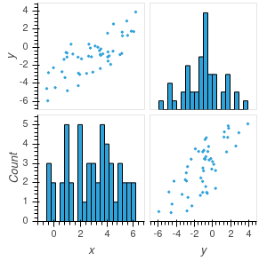

# Variance, Covariance, and Correlation

## Terminology review

- Samples and Features
- Tidy Data Matrix

## Mean
The sample mean of a feature is

$$
\mu_{X} = \frac{1}{N}\sum_{i=1}^{N} x_{i}
$$

## Variance

**Definition:** The (sample) variance of the feature measurements $x_1,\ldots, x_n$ is

$$
\sigma_{X}^2 = \frac{1}{N}\sum_{i=1}^{N} \left(x_{i}-\mu_{X}\right)^2 = \frac{1}{N}\left(\sum_{i=1}^{N} x_{i}^2\right)- \mu_{X}^2
$$

\newpage
## Covariance

**Definition:** If $X=(x_1,\ldots, x_N)$ and $Y=(y_1,\ldots, y_N)$ are two feature vectors then the (sample) covariance
is 
$$
\sigma_{XY} = \frac{1}{N}\sum_{i=1}^{N} (x_i-\mu_{X})(y_i-\mu_{Y})
$$

\newpage
## Correlation

**Definition:** Given feature vectors $X$ and $Y$, the (sample) correlation coefficient $r_{XY}$ is

$$r_{XY} = \frac{\sigma_{XY}}{\sigma_{XX}\sigma_{YY}}$$

\vskip 3in

\newpage
## The covariance matrix

**Definition:** Let $X$ be an $N\times k$ data matrix, and let $X_{0}$ be its centered version.
The (sample) covariance matrix is the $k\times k$ symmetric matrix
$$
D_{0} = \frac{1}{N}X_{0}^{\intercal}X_{0}.
$$

\newpage
## Visualizing the covariance matrix

