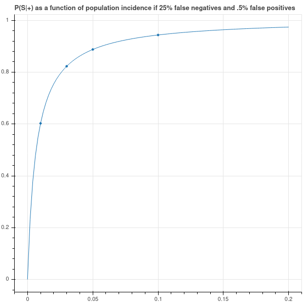

# Conditional Probability and Bayes Theorem

## Conditional Probability

- Draw a card from a deck.  $P(\mathrm{king})=4/52=1/13$.

- Now suppose you *know* the card is a face card.  Given that information, the probability of drawing a king
is $4/12=1/3$,   This is an example of *conditional probability.* $P(A|B)$.

- More generally

$$
P(A|B) = \frac{P(A\cap B)}{P(B)}
$$

Meaning the chance of getting $A$ among conditions where $B$ is known to hold.

## Bayes Theorem

**Theorem:** Given events $A$ and $B$ in a sample space $X$, we have

$$
P(A|B) = \frac{P(B|A)P(A)}{P(B)}
$$

**Proof:** Substitute $P(B\cap A)/P(A)$ for $P(B|A)$.

## An example: COVID testing

- A person can be *sick* (S) or *well* (W).

- Their covid test can be *positive* (+) or *negative* (-).

There are four possibilities:

- S+ -- this is a true positive
- S- -- this is a false negative
- W+ -- this is a false positive
- W- -- this is a true negative

An early  CDC report estimated  that $P(+|W)=1/200$ and $P(-|S)=1/4$.

## COVID testing continued

- Suppose I get a covid test and it's positive.  How likely am I to have the disease?
In other words, what is $P(S|+)$?

The answer depends on the prevalence $p=P(S)$, the chance that I have COVID in the first place.

## COVID testing continued

{width=70%}
