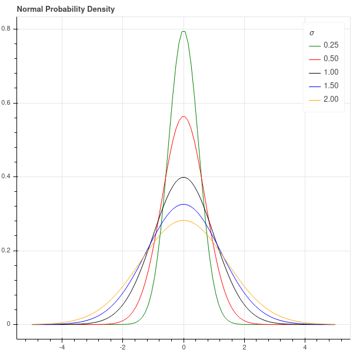

# Probability Basics

## Outcomes and Sample Space

Probability begins with a set $X$ of  "outcomes".  This set may be continuous or discrete.

- $X=\{H,T\}$, the result of a single coin flip. (discrete)

- $X$ is the possible results of throwing two six-sided dice -- ordered pairs. (discrete)

- $X$ is the set of real numbers, where a value $x$ means measuring the temperature $t_0+x$
where $t_0$ is the "true" temperature. (continous)

The set $X$ of possible outcomes is called the *sample space.*

## Event

An "event" is a subset of the sample space -- a collection of outcomes.

The probability function $P$ takes values between $0$ and $1$ and measures the "chance" that
an event "occurs."

If a sequence of events are disjoint, then the probability of them all happening is the sum
of their probabilities.

$$
P(U_1\cup\cdots\cup U_n)=\sum_{i=1}^{n} P(U_i)
$$

## Events - discrete examples

- $P(\{H\})=1/2$

- $P(\{(\epsdice{1},\epsdice{5})\}) = 1/36$

- the probability of the event $E$ consisting of throwing two dice that sum to 5:
$$
E=\{(\epsdice{1},\epsdice{4}),(\epsdice{2},\epsdice{3}),(\epsdice{3},\epsdice{2}),(\epsdice{4},\epsdice{1})\}
$$
is $(4)(1/36)=1/9$

## Events - continuous example

- $X=\mathbf{R}$.

- Probability arises from a density function $p(x)$

- $P(U) = \int_{U} p(x)dx$

- $\int_{-\infty}^{\infty}p(x)dx=1$.

## Normal distribution

- Measure temperature $t$ using a thermometer.  

- True temperature is $t_{0}$.

- Error $x=t-t_{0}$
$$
P(|t-t_{0}|<\delta) =\int_{x=-\delta}^{\delta} p_{\sigma}(x)dx
$$
where
$$
p_{\sigma}(x) = \frac{1}{\sigma\sqrt{2\pi}}e^{-x^2/(2\sigma^2)}.
$$

$\sigma$ is called the "standard deviation".

## Normal distribution cont'd

{width=70%}

