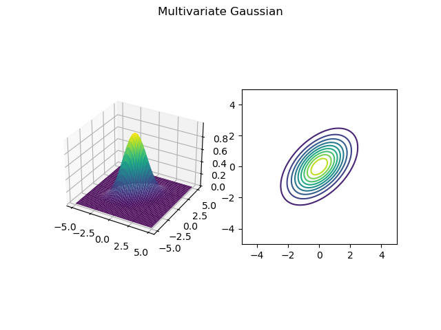

# Independence

\newpage
## Independence

*Definition:* Two events $A$ and $B$ are independent if $P(A\cap B)=P(A)P(B)$.  Alternatively,
they are independent if $P(A|B)=P(A)$ and $P(B|A) = P(B)$.  

Informally, two events are independent if they don't influence each other; knowing that $A$ happened
doesn't give you any additional information about $B$.

\newpage
## Independence Example - Discrete

- Suppose that our sample space consists of $N$ flips of a coin that has probability $p$ of
giving heads.

- The events corresponding to a $H$ in position $i$ and in position $j$ are independent.

- The chance of getting $k$ heads in $N$ flips is 

$$
P(k,N) = \binom{N}{k}p^{k}(1-p)^{N-k}
$$

The probability distribution on the set ${0,\ldots, N}$ given by this formula is called
the *binomial distribution* for parameters $p$ and $N$.

\newpage
## Independence Example - Continuous

Suppose we have a thermometer that measures the  temperature $t$ within an error
$x=t-t_{0}$ from the true temperature, where $x$ is normally distributed with standard deviation
$\sigma$.

Suppose we make $N$ independent measurements of the temperature.  How are the errors distributed?

$$
P(|x_1|<\delta,\ldots,|x_N|<\delta) = 
$$
$$
\left(\frac{1}{\sigma\sqrt{2\pi}}\right)^{N}
\int_{x_1=-\delta}^{\delta}\cdots\int_{x_N=-\delta}^{\delta}e^{-(\sum_{i=1}^{N} x_{i}^2)/(2\sigma^2)} dx_1\ldots dx_N
$$

This is the *multivariate gaussian* distribution.

\newpage
## Non-independent events

Suppose we draw a pair of real numbers $(x,y)$ from the plane $R^{2}$ controlled
by the distribution

$$
P((x,y)\in U) = A\int_{U} e^{(-x^2-xy-y^2)/(2\sigma^2)} dx dy
$$

This density function has a bump at the origin and its level curves are ellipses.

The two coordinates are not independent of each other.

\newpage
## Non-independent events

{width=70%}
