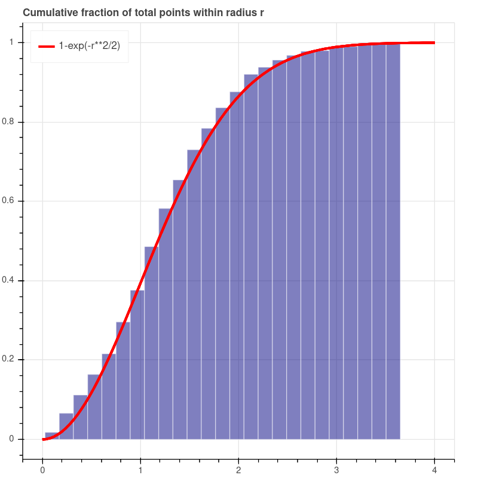

# Random Variables - continuous case

## Random Variable: Continuous Case

- We make two independent measurements of temperature $t$, where the true temperature is $t_{0}$ and the
errors $x=t-t_0$  are independent normal random variables with variance $1$.

- The sample space $X=\mathbf{R}^{2}$ and the probability density is the multivariate gaussian
$$
p(x) = \frac{1}{2\pi}e^{(-x_1^2-x_2^2)/2}=\frac{1}{2\pi}e^{-\|x\|^2/2}
$$

{width=70%}

\newpage
## Distribution of norms

- How is  $\|x\|=\sqrt{x_1^2+x_2^2}$ distributed?  $\|x\|$ is a random variable on $X$.

- What is the probability $P(\|x\|<r)$?

- Here is a histogram using the sample data above showing the distribution of the distances.  Notice
that as $r$ increases, more and more of the points lie within distance $r$ of the origin.

{width=70%}

\newpage
## Distribution of norms (continued)

- By definition, 
$$
P(\|x\|<r) = P(\{(x_1,x_2) : x_1^2+x_2^2<r^2\}) = \frac{1}{2\pi}\int_{\|x\|<r} e^{-\|x\|^2/2}
$$

- This is a doable integral using polar coordinates.

\begin{align*}
\frac{1}{2\pi}\int_{\|x\|<r} e^{-\|x\|^2/2} &= \frac{1}{2\pi}\int_{\theta=0}^{2\pi}\int_{\rho=0}^{r} e^{-\rho^2/2}\rho d\rho d\theta \\
&= \int_{\rho=0}^{r} \rho e^{-\rho^2/2} d\rho \\
& = 1-e^{-r^2/2}
\end{align*}

## Distribution of norms continued

- Here we superimpose our calculated cumulative density with the experimental data to see that they match.

{width=70%}

