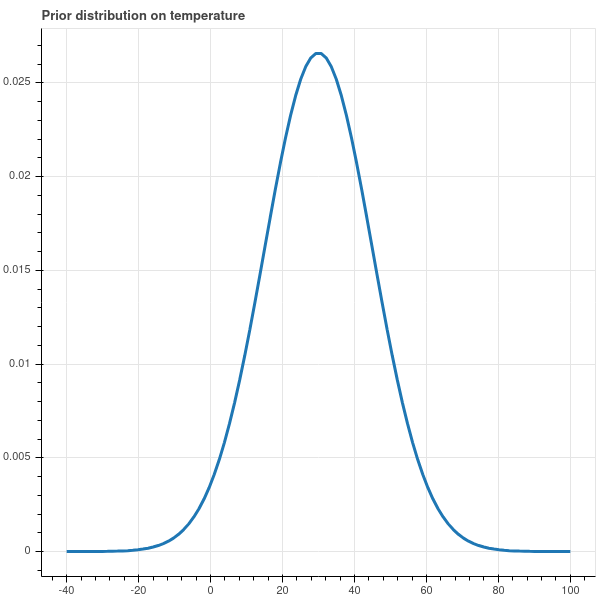

# Bayesian Inference

## Introduction

- Elements of Bayesian inference

	- a statistical model with parameters
	- a "prior distribution" on the parameters representing your state of knowledge about them
	- data arising from an experiment
	- an update to your prior distribution based on the experiment, leading to a "posterior distribution"
	

\newpage
## Example

- Rough example

	- you have a thermometer that reports the true temperature up to a normally distributed error. This is
	your statistical model. 
	- you have a prior sense that the external temperature is around 30 degrees, based on the time of day
	and the time of year. This is your prior distribution.
	- you make several independent measurements using your thermometer, and it reports temperatures
	scattered around 40 degrees.
	- You conclude that the temperature is probably closer to 40 than 30 based on this data.

\newpage
## Bayes Theorem and Bayesian Inference

Suppose that $t$ is the temperature and $D$ is the data that is the result of our experiment.
The heart of Bayesian inference is Bayes theorem:

$$
P(t|D) = \frac{P(D|t)P(t)}{P(D)}
$$

- $P(t|D)$ is the distribution of the temperature *given* the observed data.
	
- $P(D|t)$ is the probability that we would have observed the data, *given* what we
	know about the temperature.
	
- $P(t)$ is the *prior* distribution on the temperature.  
	
- $P(D)$ is the probability of the data given all possible temperatures.  Often it amounts to 
	a constant that we can ignore.
	
\newpage
## More details in a specific case

We will use temperature measurements.  There are two parameters: the true temperature $t_*$
and the variance $\sigma^2$ of the errors in measurement.  The probability density for our
temperature measurements is the normal distribution
$$
p(t) = \frac{1}{\sigma\sqrt{2\pi}} e^{-(t-t_{*})/(2\sigma^2)} dt
$$
We don't know either the true temperature $t_{*}$ or the variance $\sigma^2$.

\vskip 1in

We conduct an experiment and obtain temperature values $\mathbf{t}_0=(t_{1},\ldots, t_{n})$.

\newpage
## Bayes Theorem in the temperature case

$$
P(t_{*},\sigma^2|\mathbf{t}=\mathbf{t}_{0}) 
	= \frac{P(\mathbf{t}=\mathbf{t}_0|t_{*},\sigma^2)P(t_{*},\sigma^2)}{P(\mathbf{t}=\mathbf{t}_0}
$$

- The left hand side $P(t_{*},\sigma^2|\mathbf{t}=\mathbf{t}_{0})$ is the *posterior distribution* and it is the distribution on $t^{*}$ and $\sigma^2$ *given the results of our experiment.*

- The probability $P(\mathbf{t}=\mathbf{t}_0|t_{*},\sigma^2)$ is the *likelihood* that we would have
obtained the data we got depending on the values of  $t_{*}$ and $\sigma^2$.

- The probability $P(t_{*},\sigma^2)$ is the *prior distribution* that reflects our initial impression
of the value of these parameters.

- The denominator $P(\mathbf{t}=\mathbf{t}_0)$ is the total probability of the results of the experiment:
$$
P(\mathbf{t}=\mathbf{t}_{0}) = \int_{t_{*},\sigma^2} P(\mathbf{t}=\mathbf{t}_{0}|t_{*},\sigma^2)P(t_{*},\sigma^2)
$$
It functions as a normalizing constant and often we can get by without computing it at all.

Now we will do a worked example.
We simplify the situation so that the variance in our thermometer $\sigma_{*}^2=1$.  
Therefore the only unkown parameter is the true temperature $t_{*}$. 

\newpage
## Prior Distribution

For our prior distribution, we assume that the average temperature is $30$ degrees and the variance
of is $15$ degrees.  That yields the following prior distribution.

{width=70%}

The formula for this density is

$$
P(t_{*}) = \frac{1}{\sqrt{30\pi}}e^{-(t_{*}-30)^2/30}
$$

\newpage
## Likelihood of the data

We make independent measurements $\mathbf{t}_{0}=(t_1,\ldots, t_n)$.  

The errors are $t_{i}-t_{*}$ where $t_{*}$ is the true temperature.  We have fixed the measurement
variance at $\sigma^2=1$.  Therefore

$$
P(\mathbf{t}=\mathbf{t}_{0}|t_{*}) = (\frac{1}{\sqrt{2\pi}})^{n}e^{-\|\mathbf{t}_{0}-t_{*}\mathbf{e}\|^2/2}
$$

where $\mathbf{e}=(1,1,1,\ldots, 1)$.

\newpage
## The total probability

The total probability is the integral

$$
P(\mathbf{t}_{0}) = \int_{t_{*}} P(\mathbf{t}=\mathbf{t}_{0}|t_{*})P(t_{*})
$$

Let's just call this $T$ and avoid it for the moment.

\newpage
## Bayes Theorem

If we combine up all the constants in Bayes Theorem and call them $A$, we have
$$
P(t_{*}|\mathbf{t}=\mathbf{t}_{0}) = A e^{-\|\mathbf{t}-t_{*}\mathbf{e}\|^2/2-(t_{*}-30)^3/30}
$$

The exponent in the exponential is 

\begin{align*}
Q &= \|\mathbf{t}-t_{*}\mathbf{e}\|^2/2+(t^{*}-30)^2/30 \\
	&= (t_{*}-30)^2/30 + \sum_{i} (t_{i}-t_{*})^2/2  \\
\end{align*}

By expanding this out and completing the square, you can show that

$$
Q = (t_{*}-U)^2/2V + K
$$

where $K$ is a constant that doesn't involve $t_{*}$, 

$$ 
U = \frac{2+\sum_{i} t_{i}}{\frac{1}{15}+n}
$$

and 

$$
V = \frac{1}{\frac{1}{15}+n}
$$

\newpage
## The posterior density

The previous calculation shows that the posterior density (up to multiplicative constants B)
has the form
$$
P(t_{*}|\mathbf{t}=\mathbf{t}_{0}) = Be^{-(t_{*}-U)^2/2V}
$$

In other words, *it is a normal distribution centered at $U$ with variance $V$.*

Suppose we measured temperatures
$$
40,41,39,37, 44. 
$$

Then $n=5$, the mean of these observations is $40.2$ and the variance is $5.4$

We have  $$U=40.1$$ and $$V=0.2$$.  The posterior mean is a bit less than the observed mean because
our prior pulls it towards $30$.

Notice in the formula for $U$ and $V$ that as $N\to\infty$ the posterior mean $U$ approaches
the sample mean $\frac{1}{n}\sum t_{i}$ and the variance approaches $0$.

{width=70%}

## General Result

**Proposition:** Suppose that our statistical model for an experiment proposes that
the measurements are normally distributed around an unknown mean value of $\mu$ with
a fixed, known variance of $\sigma^2$.  Suppose that our prior distribution on $\mu$ is also
normal with mean $\mu_{0}$ and variance $\tau^2$.  Finally imagine that we make
measurements
$$
y_{1},\ldots, y_{n}.
$$

The posterior distribution on $\mu$ is again normal, with posterior variance
$$
\tau'^2 =\frac{1}{\frac{1}{\tau^2}+\frac{n}{\sigma^2}}
$$
and posterior mean
$$
\mu' = \frac{\frac{\mu_{0}}{\tau^2}+\frac{n}{\sigma^2}\overline{y}}{\tau'^2}
$$

So the posterior mean is a weighted average of the sample mean and the prior mean,
and as $n\to\infty$, the posterior mean approaches the sample mean and the prior has less
and less influence on the interpretation of the  experiment.
