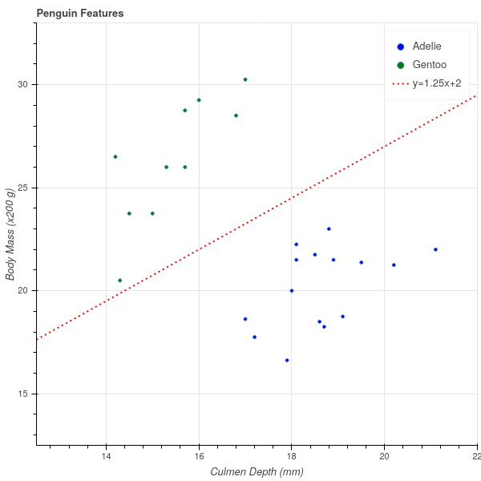
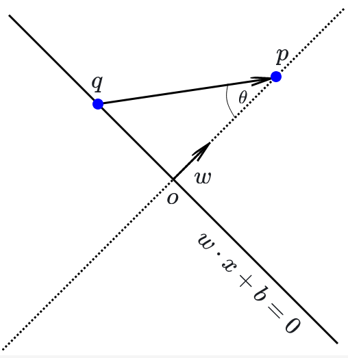

--- 
pagetitle: Support Vector Machines
colorlinks: true 
linkcolor: blue
link-citations: true 
csl: [../../resources/stat.csl]
bibliography: [../../references/references.bib]
reference-section-title: References 
---
# Support Vector Machines

## Introduction

Suppose that we are given a collection of data made up of samples from two different classes,
and we would like to develop an algorithm that can distinguish between the two classes.  For example,
given a picture that is either a dog or a cat,  we'd like to be able to say which
of the pictures are dogs, and which are cats.  For another example, we might want to be able to distinguish
"real" emails from "spam."  This type of problem is called a *classification* problem. 

Typically, one approaches a classification problem by beginning with a large set of data for which
you know the classes, and you use that data to *train* an algorithm to correctly distinguish
the classes for the test cases where you already know the answer.  For example, you start with a few thousand
pictures labelled "dog" and "cat" and you build your algorithm so that it does a good job distinguishing
the dogs from the cats in this initial set of *training data*.  Then you apply your algorithm to pictures
that aren't labelled and rely on the predictions you get, hoping that whatever let your algorithm distinguish
between the particular examples will generalize to allow it to correctly classify images that aren't
pre-labelled.

Because classification is such a central problem, there are many approaches to it.  We will see several
of them through the course of these lectures.  We will begin with 
a particular classification algorithm called "Support Vector Machines" (SVM)
that is based on linear algebra.  The SVM algorithm is widely used in practice and has a beautiful
geometric interpretation, so it will serve as a good beginning for later discussion of more complicated
classification algorithms.

Incidentally, I'm not sure why this algorithm is called a "machine"; the algorithm
was introduced in the paper @vapnik92 where it is called the "Optimal Margin Classifier" and as we shall
see that is a much better name for it.

## A simple example

Let us begin our discussion with a very simple dataset (see @penguins and @penguindata).  This data
consists of various measurements of physical characteristics of 344 penguins of 3 different species:
Gentoo, Adelie, and Chinstrap.  If we focus our attention for the moment on the Adelie and Gentoo
species, and plot their body mass against their culmen depth, we obtain the following scatterplot.

{#fig:penguins width=50%}

Incidentally, a bird's *culmen* is the upper ridge of their beak, and the *culmen depth* is a measure
of the thickness of the beak.  There's a nice picture at @penguindata for the penguin enthusiasts.

A striking feature of this scatter plot is that there is a clear separation between the clusters of
Adelie and Gentoo penguins.  Adelie penguins have deeper culmens and less body mass than Gentoo penguins.
These characteristics seem like they should provide a way to classify a penguin between these two
species based on these two measurements.

One way to express the separation between these two clusters is to observe that one can draw
a line on the graph with the property that all of the Adelie penguins lie on one side of that
line and all of the Gentoo penguins lie on the other. In +@fig:penguinsline I've drawn in
such a line (which I found by eyeballing the picture in +@fig:penguins).  The line has the equation
$$
Y = 250X+400.
$$

{#fig:penguinsline width=50%}

The fact that all of the Gentoo penguins lie above this line means that, for the Gentoo penguins,
their body mass in grams is at least $400$ more than $250$ times their culmen depth in mm. 

$$
\mathrm{Gentoo\ mass}> 250(\mathrm{Gentoo\ culmen\ depth})+400
$$

while

$$
\mathrm{Adelie\ mass}<250(\mathrm{Adelie\ culmen\ depth})+400.
$$

Now, if we measure a penguin caught in the wild, we can compute $250(\mathrm{culmen\ depth})+400$
for that penguin and if this number is greater than the penguin's mass, we say it's an Adelie; otherwise, a Gentoo.
Based on the experimental data we've collected -- the *training* data -- this seems likely to work
pretty well.

## The general case

To generalize this approach, let's imagine now that we have $n$ samples and $k$ features (or measurements)
for each sample. As before, we can represent this data as an $n\times k$ data matrix $X$.  In the penguin
example, our data matrix would be $344\times 2$, with one row for each penguin and the columns
representing the mass and the culmen depth.  In addition to this numerical data, we have a classification
that assigns each row to one of two classes.  Let's represent the classes by a $n\times 1$ vector
$Y$, where $y_{i}=+1$ if the $i^{th}$ sample is in one class, and $y_{i}=-1$ if that $i^{th}$ sample
is in the other.   Our goal is to predict $Y$ based on $X$ -- but unlike in linear regression,
$Y$ takes on the values of $\pm 1$.

In the penguin case, we were able to find a line that separated the two classes.  We can generalize
this notion to higher dimensions.

**Definition:** Suppose that we have an $n\times k$ data matrix $X$ and a set of labels $Y$ that assign the
$n$ samples to one of two classes.  Then the labelled data is said to be *linearly separable* if there
is a degree one polynomial 
$$
f(x) = f(x_1,\ldots, x_k) = a_1 x_1 + a_2 x_2 +\cdots + a_k x_k + b
$$
so that $f(x)>0$ whenever $x=(x_1,\ldots, x_k)$ is a row of $X$ -- a sample -- belonging to the $+1$ class,
and $f(x)<0$ whenever $x$ belongs to the $-1$ class.  A function $f$ that satisfies this property
is called a *separating hyperplane*.

In $\mathbf{R}^{k}$, the set of points $x$ where $f(x)=0$ is a hyperplane, and the regions where
$f(x)>0$ and $f(x)<0$ are the two "sides" of that hyperplane.  So the definition says that two sets
are linearly separable if we can find a hyperplane so that each set lies on a different side of that 
hyperplane. 

Our classification strategy, then, is to find a 
separating hyperplane $f$ for our training data. Then, given a point $x$ whose class we don't know,
we can evaluate $f(x)$ and assign $x$ to a class depending on whether $f(x)>0$ or $f(x)<0$.

This definition begs two questions about a particular dataset:

1.  How do we tell if the two classes are linearly separable?
2.  If the two sets are linearly separable, there are infinitely many separating hyperplanes. To see this,
look back at the penguin example and notice that we can 'wiggle' the red line a little bit and it will
still separate the two sets.  Which is the 'best' separating hyperplane?

For the moment, we will table the first question, and *assume* that our data belongs to two classes
that are linearly separable, and we will look at one possible answer to the second question: what's
the best separating hyperplane?

## Margins

Let's look at a simplified version of the penguin data, where we have two linearly separable
clusters of points in the plane.  In +@fig:penguinsimple we show a plot of a randomly selected
subset of the penguin points, along with the line $Y=250X+400$ that we eyeballed earlier.

{#fig:penguinsimple width=50%}

One way to measure how well this line separates the two clusters is to ask how close the nearest
point in each cluster is to the line.  Looking at +@fig:penguinsimple, you'll notice that the line is closer to the
green (Gentoo) cluster than it is to the blue (Adelie) cluster. So, at least as far as this subset
of the data is concerned, we could get better separation if we moved the line downwards.  

Of course, we could also tilt the line by changing its slope, and perhaps if we increased the slope
a bit, that would get us better separation as well.

In any case, this suggests that we measure the effectiveness of our line at separating the two clusters
by *looking at the distance from the line to the closest point(s) in each cluster, and trying to make those
distances as large as possible.*  

The following lemma reminds us of a few facts about hyperplanes in $\mathbf{R}^{k}$,
including how to compute the distance from a point to a  line (or to a hyperplane in
higher dimensions).

**Lemma:** Let $f(x_1,\ldots, x_k) = \sum_{i=1}^{k} a_i x_i +b$ with not all $a_i=0$.  Let
$w=(a_1,\ldots,a_k)$ viewed as a vector in $\mathbf{R}^{k}$, so that if we view $x=(x_1,\ldots, x_k)$
as a vector we can write a vector version of $f$:
$$
f(x)=w\cdot x+b.
$$

- The vector $w$ is normal vector to the hyperplane $f(x)=0$.  Concretely this means that if $p$ and $q$ are any two
points in that hyperplane, then $w\cdot (p-q)=0$. 
- Let $p=(u_1,\ldots,u_k)$ be a point in $\mathbf{R}^{k}$. Then the perpendicular distance $D$ from $p$ to the hyperplane $f(x)=0$ is
$$
D = \frac{f(p)}{\|w\|}
$$

**Proof:** For the first part, suppose that $p$ and $q$ satisfy $f(x)=0$.  Then $w\cdot p+b = w\cdot q+b=0$. Subtracting these two
equations gives $w\cdot (p-q)=0$, so $p-q$ is orthogonal to $w$.

For the second part, consider +@fig:triangle.  The point $q$ is an arbitrary point on the hyperplane defined by the equation
$w\cdot x+b=0$.  The distance from the hyperplane to $p$ is measured along the dotted line perpendicular to the hyperplane.
The dot product $w\cdot (p-q) = \|w\|\|p-q\|\cos(\theta)$ where $\theta$ is the angle between $p-q$ and the hyperplane. The
distance $D$ is therefore 
$$
D=\frac{w\cdot(p-q)}{\|w\|}.
$$
However, since $q$ lies on the hyperplane, we know that $w\cdot q+b=0$ so $w\cdot q = -b$.  Therefore $w\cdot(p-q)=w\cdot p+b=f(p)$,
which is the formula we seek.

{#fig:triangle width=50%}

