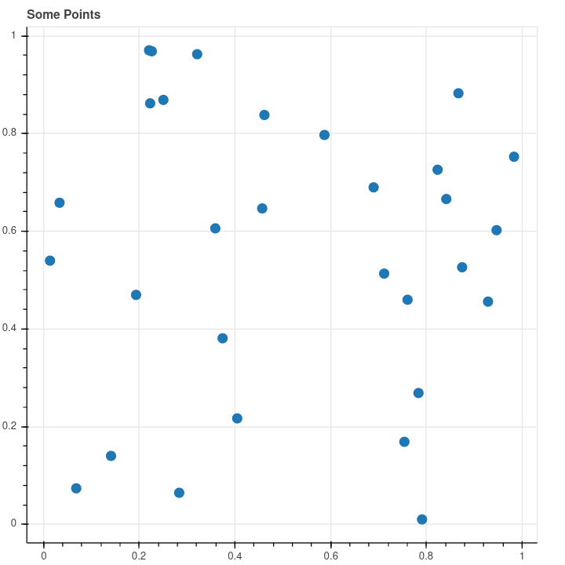
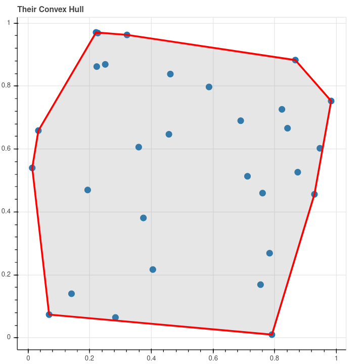
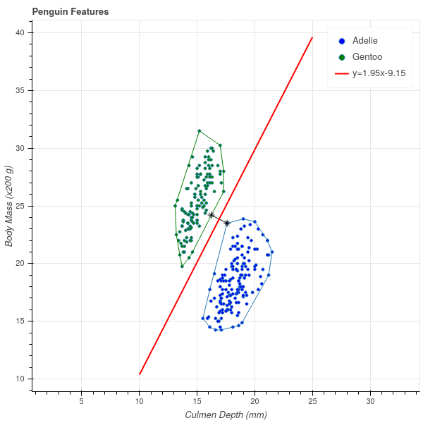
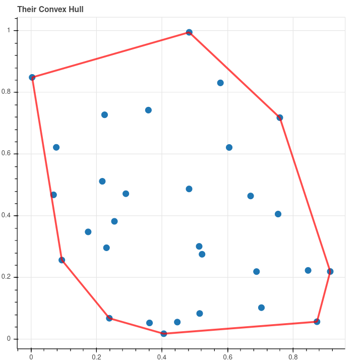

# Convexity and Convex Hulls

\newpage
## Convex sets

**Definition:** A subset $U$ of $\mathbb{R}^{k}$ is *convex* if, for any pair of points $p,q\in U$, 
the line segment joining $p$ to $q$ is in $U$.  In vector terms, if $p,q\in U$, then 
for every $0\le s\le 1$, $t(s)=(1-s)p+sq$ belongs to $U$.

\vskip 3in

**Proposition:** The intersection of convex sets is convex.

\newpage
## Convex Hulls

**Definition:** Let $S$ be a finite set of points $\{q_1,\ldots,q_{N}\}$ be a finite set of points in $\mathbb{R}^{k}$.
The *convex hull* $C(S)$ is the set of points
$$
p=\sum_{i=1}^{N} \lambda_{i}q_{i}
$$
as $(\lambda_{1},\ldots,\lambda_{N})$ runs over all $N$-tuples of real numbers such that
$$
\sum_{i=1}^{N} \lambda_{i}=1. 
$$

{width=50%}  {width=50%}

\newpage
## A Look Ahead

We care about convex hulls because of the following result that we will (eventually) prove.

**Proposition:** The optimal margin between two linearly separable sets $A^{+}$ and $A^{-}$
is equal to the closest distance between points in their convex hulls.

{width=70%}

In addition, there is an iterative algorithm called "Sequential Minimal Optimization" that can find these closest
points.

\newpage
## More on Convex Hulls

{width=20%}

**Proposition:** $C(S)$ is convex.

\newpage
## The convex hull is the smallest containing convex set

**Proposition:** $C(S)$ is the smallest convex set containing $S$. In other words, if $U$ is a convex
set containing $S$, then $C(S)\subset U$. 

**Proof:** By induction.

- Let $C_{n}(S)$ be the set of points $\sum_{i=1}^{n} \lambda_{i}q_{i}$ where $\sum_{i=1}^{n}\lambda_{i}=1$
and all $\lambda_{i}$ are non-zero.

- $C(S)=\bigcup_{i=1}^{\infty} C_{n}(S)$
- $U$ convex means $C_{2}(S)\subset U$.
- We show $C_{n}(S)\subset U\implies C_{n+1}(S)\subset U$.  

\vskip 3in
- By induction this shows that $C_{n}(S)\subset U$ for all $n$ and therefore $C(S)\subset U$.

\newpage
## Convex Hulls and Supporting Hyperplanes

**Proposition:**  $S$ and $C(S)$ have the same supporting hyperplanes.

- Remember that $f(x)=w\cdot x+b=0$ is a supporting hyperplane for a set $A$ if $f(a)\ge 0$ for all
$a\in A$ and $f(a)=0$ for at least one $a\in A$.

\vfill

- If $f=0$ is a supporting hyperplane for $S$, then $S$ is contained in the half plane $f\ge 0$ and $f(q)=0$
for some $q\in S$.  The halfplane is a convex set, so $C(S)$ is contained in it, and $q\in C(S)$ and $f(q)=0$
so $f=0$ is a supporting hyperplane for $C(S)$.

\vfill

- Suppose $f=0$ is a supporting hyperplane for $C(S)$. Let $p$ be the point in $C(S)$ where $f(p)=0$. Note that
$p$ need not be in $S$ as far as we know. However, 
since $f\ge 0$ for all $a\in C(S)$, and $S\subset C(S)$,
we have $f\ge 0$ for all $q\in S$.  The question is whether there is $q\in S$ with $f(q)=0$. 
\vfill
\newpage

- Let $q$ be the point in $S$ at which $f(q)$ is minimal.  Then $g(x)=f(x)-f(q)$ is a hyperplane  that
is $0$ at $q$ and $g(x)\ge 0$ for all $x\in S$. Since the half space $g(x)\ge 0$ is convex and contains $S$,
$C(S)$ is contained in that half space and so $g(x)\ge 0$ for all points in $C(S)$. 

\vskip 3in

- Now $g(p) = f(p)-f(q) = 0-f(q)\ge 0$ and $f(q)\ge 0$.  Therefore $f(q)=0$, and we found a point $q\in S$
where $f$ vanishes.

\newpage
## Convex Hulls and Supporting Hyperplanes

**Proposition:** Let $K$ be the set of supporting hyperplanes $f(x)=w\cdot x+b=0$ for $S$ where
$f(x)\ge 0$ for all $x\in S$.  Then $C(S)$ is the intersection of all the positive half spaces
for $f\in K$. 

**Proof:**

- $C(S)$ is contained in the intersection, since the intersection is convex and contains $S$.

\vskip 2in

- Suppose that $p$ is not in $C(S)$.  Let $s$ be the point in $C(S)$ closest to $p$.  Let $w=s-p$
and let $f(x)=w\cdot x - w\cdot s$.  The hyperplane $f(x)=0$ is perpendicular to the line joining
$p$ to $s$ and passes through $s$.  Also $f(p)<0$ by construction.

\newpage

- We claim that $f(x)=0$ is a supporting hyperplane for $C(S)$ (and therefore $S$). In other words, $f(x)\ge 0$ for all 
$x\in S$. Thus $p$ is not in the intersection
of the half spaces, which proves the proposition.  To see this we draw a picture.

\newpage
## Convex Hulls of finite point sets are compact

**Proposition:** $C(S)$ is compact.

**Proof:**

- It is an intersection of closed sets, therefore closed.

\vfill

- It is bounded.

\vfill
