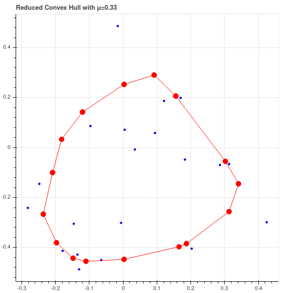
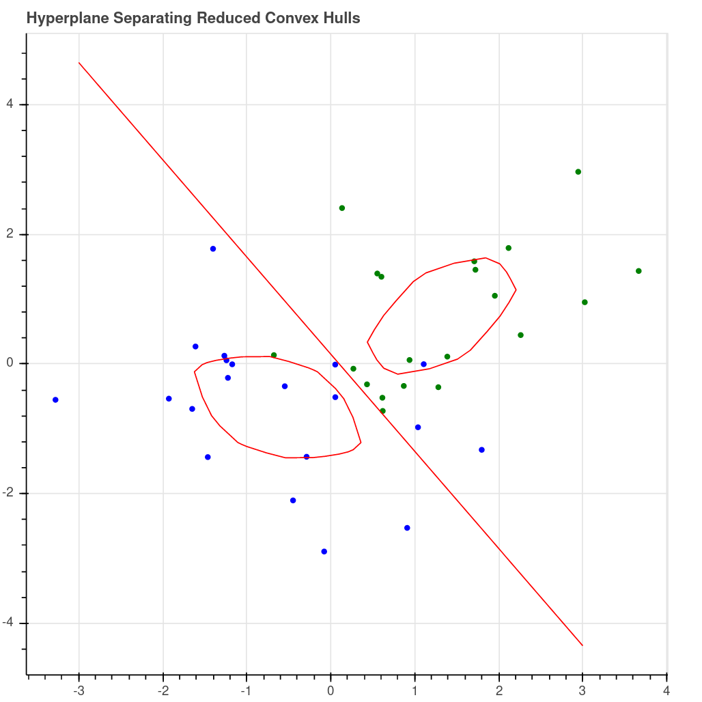
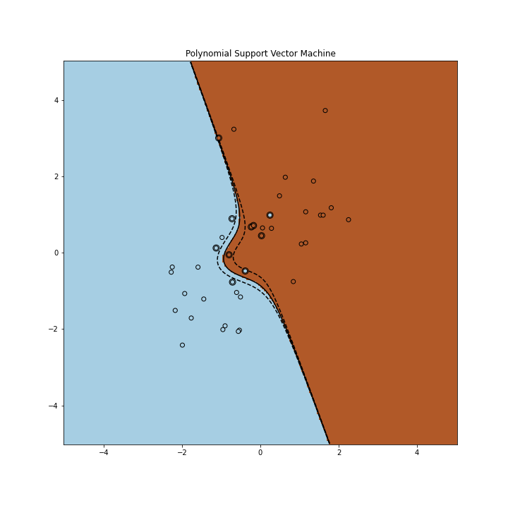

# Support Vector Machines in real life

## Three ideas for support vector machines

1. Sets that aren't linearly separable.
2. Kernel functions and non-linear boundaries
3. Multiclass classification
\vfill
\newpage

## Reduced convex hulls and non-separable sets

In practice, we typically DO NOT have linearly separable sets.

\vfill
In this case, we can look for a classifying hyperplane that puts **most** of the positive
points on one side and **most** of the negative points on the other.

\vfill
One approach is to do this by using the *reduced convex hulls*
$$
C(A,r) = \{\sum_{i=1}^{n}\lambda_i x_{i} : 0\le\lambda_i\le r, \sum_{i=1}^{n}\lambda_{i}=1\}
$$

{width=50%}

\newpage

## Reduced convex hulls and SVM

In practice, we choose a value $r$ and find the closest points between the reduced convex hulls.  This
can be done by the SMO algorithm, the only change being the constraint on $\delta$ which becomes:
$$
\delta\ge\max\{-\lambda_{i}^{+},-\lambda_{j}^{-}\}
$$
and
$$
\delta\le\min\{r-\lambda_{i}^{+},r-\lambda_{j}^{-}\}.
$$

{width=50%}

\newpage

## Kernel functions

Recall that the function that we were trying to minimize depended only on the inner products
$(x_{i}^{\pm},x_{j}^{\pm})$.  This allows for something called the *kernel trick.*

We can choose a **different** set of values for the dot products -- basically, any collection
of dot products so that the symmetric matrix $(x_{i}^{\pm},x_{j}^{\pm})$ is positive (semi)-definite --
any redo the analysis.  This matrix is called a *kernel.*

This amounts to embedding the points in a high dimensional space, possibly by a non-linear map,
and finding the classifying hyperplane there.

Common choices of kernels:

- polynomial: finds separating polynomial curves instead of lines.
- radial basis kernel (rbf): this sets the "distance" between $x$ and $y$ to be 
$$
(x,y) = e^{-\|x-y\|^2/2\sigma^2}.
$$
This greatly rescales the distance between points.

\newpage

## Example 

{width=80%}

\newpage

## Multiclass classification

In general, the idea is to train classifiers that discriminate each class from all of the others.

This requires $\binom{n}{2}$ classifiers. 
