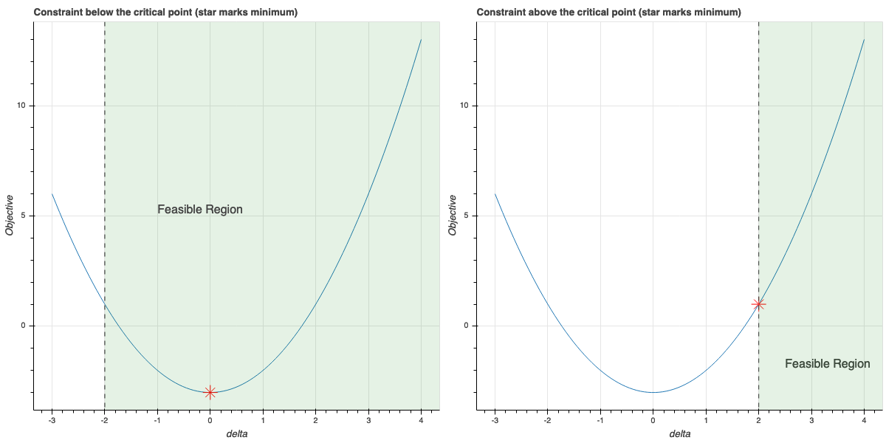

# Sequential Minimal Optimization

## SMO (Platt, 1998)

**Problem:** Given sets $A^{\pm}=\{x^{\pm}_{1},\ldots,x^{\pm}_{n_{\pm}}\}$, minimize
$$
Q(\lambda^{+},\lambda^{-}) = \|\sum_{i=1}^{n_{+}}\lambda_{i}^{+}x^{+}_{i}-\sum_{i=1}^{n_{-}}\lambda^{-}_{i}x^{-}_{i}\|^2 - \sum_{i=1}^{n_{+}}\lambda^{+}_{i} - \sum_{i=1}^{n_{-}}\lambda^{-}_{i}
$$
subject to the constraints $\lambda^{\pm}_{i}\ge 0$ for all $i$ and 
$$
\sum_{i=1}^{n_{+}}\lambda^{+}_{i} = \sum_{i=1}^{n_{-}}\lambda^{-}_{i}=\alpha.
$$

**Strategy:** 

0. Start at a random point $\lambda^{+},\lambda^{-}$ satisfying the constraints.
\vfill
1. Pick a pair $\lambda^{+}_{i}$ and $\lambda^{-}_{j}$.  
\vfill
2. Holding all other $\lambda^{\pm}$ constant, change $\lambda^{+}_{i}$ and $\lambda^{-}_{j}$
by *the same amount* $\delta$ so that
$$
\lambda^{+}_{i} + \delta\ge 0\hbox{\rm\ and\ }\lambda^{-}_{j}+\delta\ge 0
$$
and $Q(\lambda^{+},\lambda^{-})$ decreases when you replace $\lambda^{+}_{i}$ by $\lambda^{+}_{i}+\delta$
and $\lambda^{-}_{j}$ by $\lambda^{-}_{j}+\delta$.  Note the constraints are still satisfied.
\vfill
3.  Repeat this process until the $\lambda^{\pm}$ change by an amount less than some preset tolerance.
\vfill
4. $p(\lambda^{+})=\sum_{i=1}^{n_{+}}\lambda_{i}^{+}x^{+}_{i}$ and $q(\lambda^{-})=\sum_{i=1}^{n_{-}}\lambda_{i}^{-}x^{-}_{i}$ are the closest points.
\newpage

## SMO algorithm continued

Following this strategy, consider $Q$ as a function of $\lambda^{+}_{i}$ and $\lambda^{-}_{j}$,
with all other $\lambda^{\pm}$ treated as constants.  Recall that
$$
w(\lambda^+,\lambda^-)=\sum_{i=1}^{n_{+}}\lambda^{+}_{i}x^{+}_{i} - \sum_{i=1}^{n_{-}}\lambda^{-}x^-_{i}
$$
and that
$$
Q(\lambda^+,\lambda^-) = \|w(\lambda^+,\lambda^-)\|^2-\sum_{i=1}^{n_{+}}\lambda^+ -\sum_{i=1}^{n_{-}}\lambda^-.
$$
\vfill
Changing $\lambda^+_{i}\mapsto \lambda^{+}_{i}+\delta$ and $\lambda^-_{j}\mapsto \lambda^{-}_{j}+\delta$
amounts to replacing $w(\lambda^+,\lambda^-)$ by 
$$
w_{\delta,i,j}(\lambda^+,\lambda^-) = w(\lambda^+,\lambda^-)+\delta(x^{+}_{i}-x^{-}_{j}).
$$
\vfill
Also, $\alpha\mapsto \alpha+\delta$.

To make the change that makes $Q$ get as much smaller as possible, we want to choose $\delta$
to minimize
$$
Q_{new}(\delta) = \|w_{\delta,i,j}(\lambda^{+},\lambda^{-})\|^2-2\alpha-2\delta
$$
subject to the constraint that $\delta\ge\max\{-\lambda^{+},-\lambda^{i}\}.$
\vfill
This is a one variable minimization problem of a quadratic polynomial.

\newpage

## SMO continued

{width=70%}

Remember that $\delta\ge\min\{-\lambda_{i}^{+},-\lambda_{j}^{-}\}.$

\newpage

## SMO continued. 

To minimize $Q_{new}$ we compute the derivative with respect to $\delta$:
$$
\frac{d}{d\delta}(\|w_{\delta,i,j}(\lambda^+,\lambda^-)\|^2-2\alpha-2\delta) = 2w_{\delta,i,j}(\lambda^+,\lambda^-)\cdot (x^+_{i}-x^{-}_{j}) -2.
$$
Setting this equal to zero yields the formula
$$
\delta_{i,j} = \frac{1-w(\lambda^+,\lambda^-)\cdot(x^+_{i}-x^{-}_{j})}{\|x^+_{i}-x^-_{j}\|^2}.
$$
\vfill
To reduce the size of $Q_{new}$ as much as possible, while preserving the constraints:

- If $\delta_{i,j}\ge\max\{-\lambda^+_{i},-\lambda^-_{j}\}$, then replace $\lambda^{+}_{i}$ and
$\lambda^{-}_{j}$ by $\lambda^{+}_{i}+\delta_{i,j}$ and $\lambda^{-}_{j}+\delta_{i,j}$ respectively.

- Otherwise  let $M=\max\{-\lambda^+_{i},-\lambda^{-}_{j}\}$ and  replace $\lambda^{+}_{i}$ and
$\lambda^{-}_{j}$ by $\lambda^{+}_{i}+M$ and $\lambda^{-}_{j}+M$ respectively -- so one of the 
$\lambda$'s will become zero.
\vfill
\newpage

## The SMO algorithm summarized.
\vfill
**Algorithm (SMO)**
\vfill
**Given:** Two linearly separable sets of points $A^{+}=\{x_{1}^{+},\ldots,x_{n_{+}}^{+}\}$ and
$A^{-}=\{x_{1}^{-},\ldots, x_{n_{-}}^{-}\}$ in $\mathbf{R}^{k}$.
\vfill
**Find:** Points $p$ and $q$ belonging to $C(A^{+})$ and $C(A^{-})$ respectively such that
$$
\|p-q\|^2=\min_{p'\in C(A^{+}),q'\in C(A^{-})} \|p'-q'\|^2
$$
\vfill
**Initialization:** Set $\lambda_{i}^{+}=\frac{1}{n_{+}}$ for $i=1,\ldots, n_{+}$ and
$\lambda_{i}^{-}=\frac{1}{n_{-}}$ for $i=1,\ldots, n_{-}$.  Set 
$$
p(\lambda^{+})=\sum_{i=1}^{n_{+}}\lambda^{+}_{i}x^{+}_{i}
$$
and
$$
q(\lambda^{-})=\sum_{i=1}^{n_{-}}\lambda^{-}_{i}x^{-}_{i}
$$
Notice that $w(\lambda^{+},\lambda^{-})=p(\lambda^{+})-q(\lambda^{-})$.
Let $\alpha=\sum_{i=1}^{n_{+}}\lambda^{+}=\sum_{i=1}^{n_{-}}\lambda^{-}$.  These sums
will remain equal to each other throughout the operation of the algorithm.
\vfill

\newpage

## SMO continued

**Iteration:** Repeat the following steps until maximum value of  $\delta^{*}$ computed
in each iteration is smaller than some tolerance (so that the change in all of the $\lambda$'s
is very small):
\vfill
- For each pair $i,j$ with $1\le i\le n_{+}$ and $1\le j\le n_{-}$, compute
$$
M_{i,j} = \max\{-\lambda_{i}^{+},-\lambda_{j}^{-}\}
$$
and 
$$
\delta_{i,j} = \frac{1-(p(\lambda^{+})-q(\lambda^{-}))\cdot(x_{i}^{+}-x_{j}^{-})}{\|x^+_{i}-x^{-}_{j}\|^2}.
$$
If $\delta_{i,j}\ge M$ then set $\delta^{*}=\delta_{i,j}$; otherwise set $\delta^{*}=M$.  Then update
the $\lambda^{\pm}$ by the equations:
$$
\begin{aligned}
\lambda^{+}_{i}&=&\lambda^{+}_{i}+\delta^{*} \\
\lambda^{+}_{j}&=&\lambda^{-}_{j}+\delta^{*} \\
\end{aligned}
$$
\vfill

When this algorithm finishes, $p\approx p(\lambda^{+})$ and $q\approx q(\lambda^{-})$ will be very good approximations
to the desired closest points.
\vfill

\newpage

## SMO conclusion

Recall that if we set $w=p-q$, then the optimal margin classifier is
$$
f(x)=w\cdot x - \frac{B^{+}+B^{-}}{2}=0
$$
where $B^{+}=w\cdot p$ and $B^{-}=w\cdot q$.  Since $w=p-q$ we can simplify this to obtain
$$
f(x)=(p-q)\cdot x -\frac{\|p\|^2-\|q\|^2}{2}=0.
$$

{#fig:penguinsolution width=50%}

